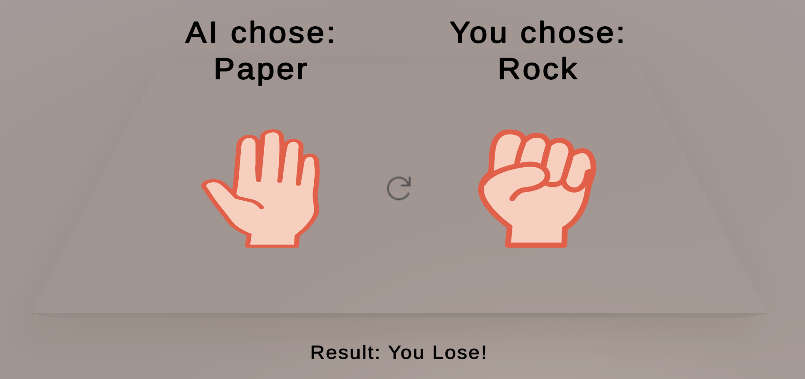

# ✊ Rock Paper Scissors – Animated Desktop Game Prototype

**Rock Paper Scissors** is a keyboard-controlled Unity game prototype featuring gesture animations, AI opponent logic, and polished UI. Built without the need for a VR headset, this version mimics real-time interaction through visual feedback and dynamic transitions — while laying the groundwork for future XR integration.

> 🎮 *This is the first version of the game, built entirely without a VR headset.*

---

## 🚀 Features

- 🎰 **Spinning Gesture Animation**  
  Simulates a slot-machine-like draw before selection.

- ⌨️ **Keyboard Input for Player Move**  
  Use keys `1`, `2`, or `3` to play Rock, Paper, or Scissors.

- 🤖 **Random AI Opponent**  
  AI generates its move after each player input.

- 🖼️ **Sprite-Based Gesture Feedback**  
  Selected gestures are displayed using UI images.

- 🔄 **Restart Mechanism**  
  Play Again button resets the round and reactivates animations.

- 🧯 **Input Locking**  
  Prevents accidental re-entry before reset.

---

## 🖼️ Game Preview

---

## 🛠️ Tech Stack

- **Unity** (2022 or later)
- **C#**
- **TextMeshPro UI**
- **2D Sprite-Based UI Layout**

---

## 🧩 Upcoming Features

- 🖐️ **VR Hand Gesture Input (XR Toolkit)**  
  Support for gesture recognition using VR controllers.

- ✋ **3D Hand Models & Animations**  
  Replace sprites with animated hand meshes for
